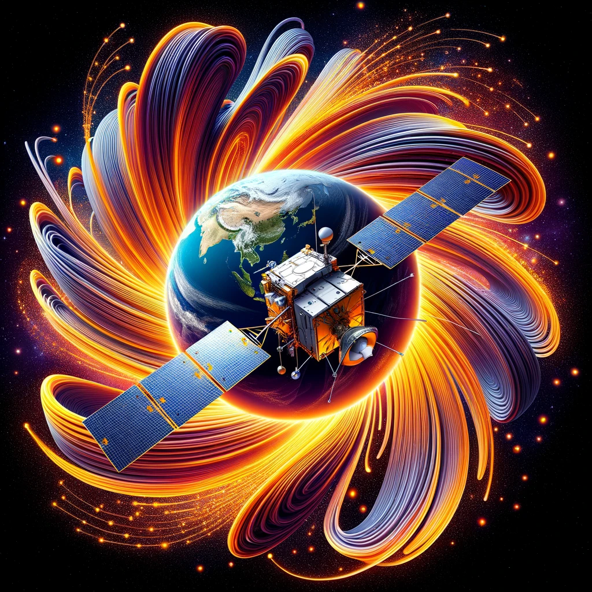

# INTRODUCTION

Solarity is a solution of Thyrus Team to the NASA challenge "The Oracle of DSCOVR".

We have prototyped a warning system for potentially risky space weather events, by leveraging machine learning to refine geomagnetic storm forecasts, training an RNN model on data from the DSCOVR probe.

# ABOUT THE CHALLENGE

When operating reliably, the National Oceanic and Atmospheric Administration’s (NOAA’s) space weather station, the Deep Space Climate Observatory (DSCOVR), can measure the strength and speed of the solar wind in space, which enables us to predict geomagnetic storms that can severely impact important systems like GPS and electrical power grids on Earth. DSCOVR, however, continues to operate past its expected lifetime and produces occasional faults that may themselves be indicators of space weather. The challenge is to use the raw and corrupted data from DSCOVR—faults and all—to predict geomagnetic storms on Earth.

# THE PROTOTYPE
The approach used was to directly pass raw data from the DSCOVR probe as input to a machine learning model, as suggested by NASA, searching for patterns and correlations between the satellite's electronic faults and geomagnetic storms on Earth. This is possible because of the physics behind the phenomenon.

The data that we recognized as useful were:

1) the raw measurements of the probe's sensors (susceptible to errors in transmission)
2) faults in telemetry
3) the interference of the solar wind with the operation of the EPIC photographic sensor always aimed at the earth

The basic assumption is that there is a correlation between the number of equipment faults with the intensity of geomagnetic storms on the ground, estimated with the Kp-index.

The proposed prototype is composed of an RNN neural network that takes as input the data from the DSCOVR probe provided by the challenge and correlates it with the Kp recorded on the ground as model output; training with this data forces the neural network to calibrate its weights to find possible correlations.

The choice of an LSTM model depended on the fact that it was not sufficient to have a simple regression done with a fully-connected neural network on the data as if it occurred simultaneously both on the satellite and on the ground, infact we prove to extract possible information in the behavior of the phenomena over time.

Furthermore, this choice opens the way to other considerations, such as the possibility of predicting how long after a possible geomagnetic storm could reach the Earth and his intensity. This would be possible by inserting as output to the network not only the Kp measured on the ground, but also the delta t between the probe measurement and the magnetic activity on the Earth, allowing the network to implicitly learn the correlations between these data.

# DASHBOARD
All this information must be able to be consulted and understood quickly, which is why we have programmed a data visualization and prediction system that could be extremely useful for many stakeholders that depend on space weather, such as the telecommunications industry, space agencies or electricity distribution services.

A crucial role in data visualization occurs by crossing telemetry and sensor data with photographic data. The satellite takes images of the Earth in raw format and sends it at a level called L0; these shots are extremely sensitive to noise caused by any physical phenomenon with electromagnetic origin. In this way, not only the faults of the scientific data, but all the possible causes of data corruption which allow the predictions of the Kp parameter to be refined.

# IMPROVEMENTS
Possible improvements are certainly to add convolutional filters in case you want to use the raw photographic data from the EPIC camera for more than one reason, the most relevant of which is the reduction of the dimensionality of the data to carry out efficient training, changing and upgrading the topology of the neural network for this job.

Another improvement is to create a dataset that associates the measurement of a strong magnetic phenomenon with the satellite readings to estimate the delta t between the phenomena on Earth (because the solar wind takes a certain time to reach the ground once it has intercepted the probe), to train the neural network over it and have more accurate predictions on when Kp is high.

# REQUIREMENTS
This type of analysis requires a lot of memory and computing power; accurate predictions require massive training over the entire history of the probe, which cannot be easily performed by common personal computers.

Furthermore, understanding which parameters to use to obtain the best results in the field of machine learning is still an open problem for mathematics and finding the suitable parameters to obtain acceptable validations requires a lot of computing power.

# ABOUT THE TEAM

We are a team of 4 Space Enthusiast: an astrophysicist, a physicist, an astrophotographer and a science communicator. We are all involved in space-related jobs and we're members of our local astronomical association, where we put our effort to spread the knowledge about the universe and space exploration.

Visit https://www.spaceappschallenge.org/2023/find-a-team/thyrus-team/ for more.
